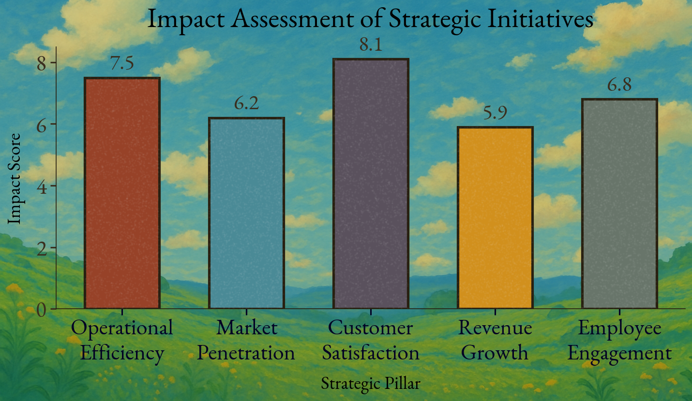

# 🌸 Ghibli-Style Bar Chart

A whimsical, hand-crafted bar chart inspired by the warm aesthetic of Studio Ghibli. Features gentle color palettes, watercolor background, and grainy white noise textures for a soft, organic feel.

  

---

## 📊 What It Does

This Python script generates a stylized bar chart with:

- Custom Ghibli-inspired color themes
- Optional EB Garamond font support
- Watercolor-style background image
- White noise grain overlay for a textured, analog look

Great for giving your visualizations a storytelling or artistic edge.

---

## 🧰 Requirements

- Python 3.7+
- Libraries:
  - `matplotlib`
  - `numpy`
  - `Pillow`

Install them with:

```bash
pip install matplotlib numpy pillow
```

---

## 🎨 Customization

### 1. Font

This chart uses **EB Garamond** for a bookish, soft feel. Make sure `EBGaramond-Regular.ttf` is in your working directory.

> Don’t have it? Download it from [Google Fonts](https://fonts.google.com/specimen/EB+Garamond) and place it next to the script.

### 2. Background Image

The watercolor texture should be named `watercolor_bg.png` and placed in the same directory as the script.

> Replace it with any image of your choice — just keep the same filename or adjust the script accordingly.

---

## 🚀 How to Run

```bash
python ghibli_bar_chart.py
```

This will render a bar chart titled, with a soft visual style and a handcrafted touch.


---

## 📁 Project Structure

```
📁 your-project-folder/
├── ghibli_aesthatics_graphs.py
├── EBGaramond-Regular.ttf
└── watercolor_bg.png
```

---

## 💡 Credits & Inspiration

Inspired by the visual storytelling and organic feel of **Studio Ghibli** — warm, nostalgic, and atmospheric.

---

## 📝 License

MIT — free to use, modify, and share. Attribution is appreciated but not required.

